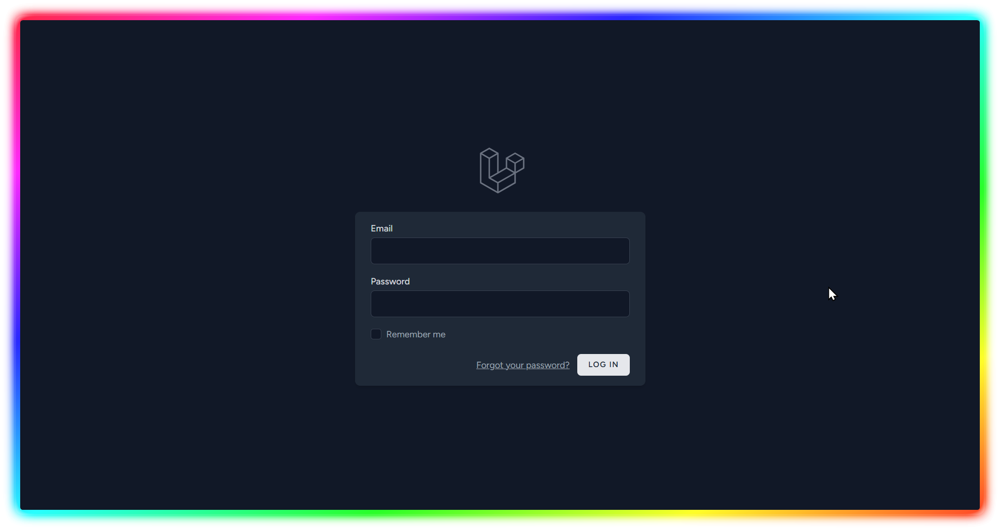
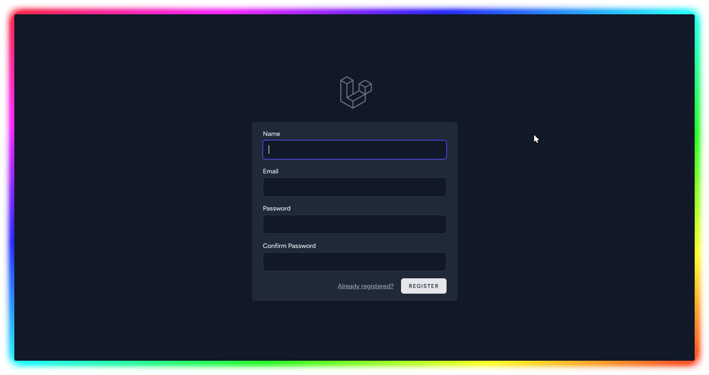
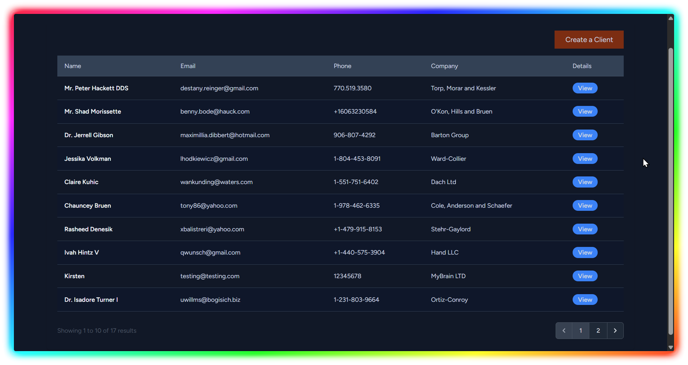
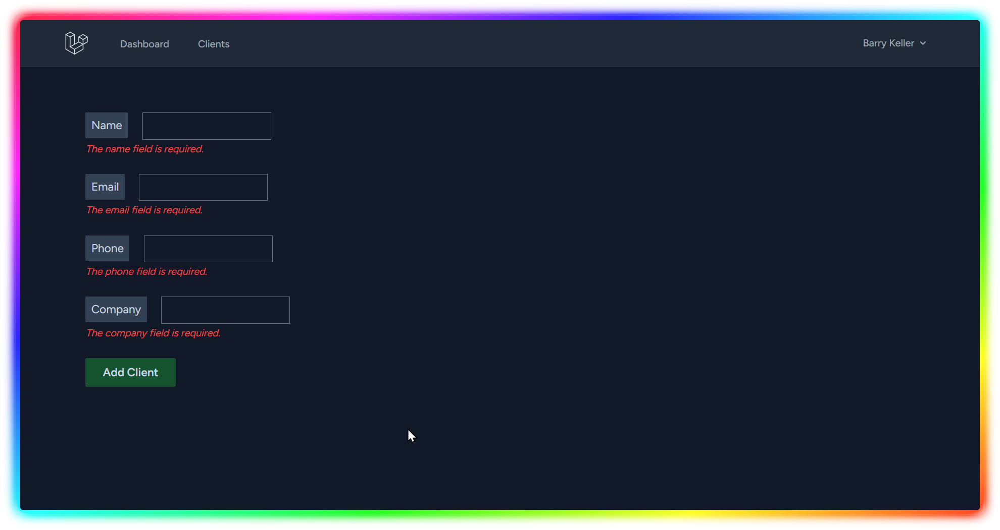
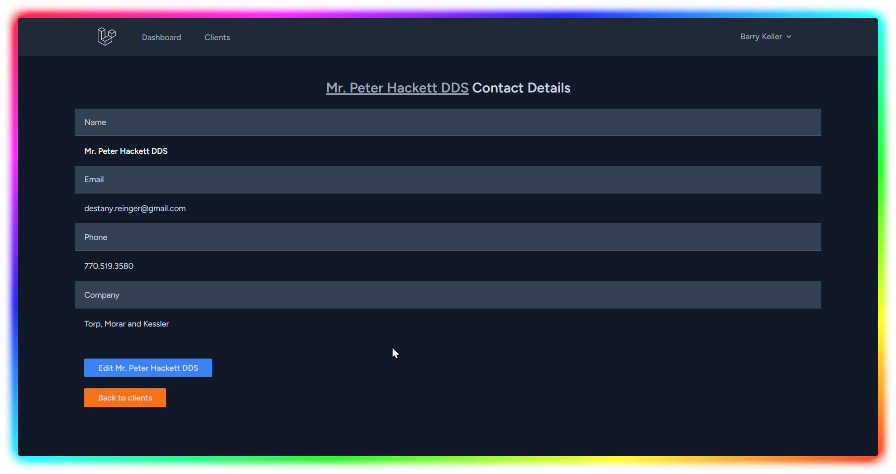
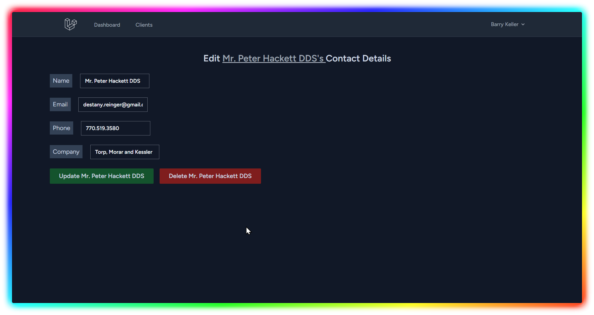

# 🤝 Kinship CRM

**A simple Laravel-based CRM for learning and practice**

[](https://laravel.com)
[](https://php.net)
[](LICENSE)

> **Note:** This is a hands-on learning project built independently. The goal is to master Laravel fundamentals through practical development experience and create a portfolio-worthy open-source project.

---

## ✨ Current Features

- 🔐 User authentication (register/login)
- 👥 Full client management (CRUD)
- 📄 Form validation with error handling
- 📊 Paginated lists
- 🎨 Clean Tailwind UI

---

## 🛠️ Technology Stack

- **Framework:** Laravel 11.x
- **Language:** PHP 8.2+
- **Database:** SQLite 3
- **Authentication:** Laravel Breeze
- **Frontend:** Blade Templates + Tailwind CSS
- **Package Manager:** Composer & NPM

---

## 📊 Database Schema

### Current Tables

**Users** (Laravel Breeze default)
```
├─ id
├─ name
├─ email
├─ password
└─ timestamps
```

**Clients**
```
├─ id
├─ name (required)
├─ email (nullable)
├─ phone (nullable)
├─ company (nullable)
├─ is_active (boolean, default: true)
├─ created_at
├─ updated_at
└─ deleted_at (for soft deletes - coming soon)
```

### Coming Soon
- **Projects** (with client relationships)
- **Tasks** (with project relationships)

---

## 📸 Screenshots

### Authentication



### Client Management

*Paginated list of all clients with action buttons*


*Form with validation for adding new clients*


*Individual client view with contact information*


*Form to edit client information*

---

## 🚀 Installation

### Prerequisites
- PHP 8.2 or higher
- Composer
- SQLite 3
- Node.js & NPM

### Setup Instructions

1. **Clone the repository**
```bash
   git clone https://github.com/ofthewildfire/upgraded-octo-robot.git
   cd upgraded-octo-robot
```

2. **Install PHP dependencies**
```bash
   composer install
```

3. **Install NPM dependencies and build assets**
```bash
   npm install
   npm run build
```

4. **Environment setup**
```bash
   cp .env.example .env
   php artisan key:generate
```

5. **Configure your database**

   Open `.env` and update these values:
```
   DB_CONNECTION=sqlite
   DB_DATABASE=/absolute/path/to/database.sqlite
```

Create the SQLite database file:
```bash
   touch database/database.sqlite
```

6. **Run migrations and seed the database**
```bash
   php artisan migrate:fresh --seed
```

This will create 20 demo clients with realistic data.

7. **Start the development server**
```bash
   php artisan serve
```

8. **Access the application**

   Visit `http://localhost:8000` in your browser

   **Default Login:**
    - Email: `test@example.com`
    - Password: `password`

---

## 🎯 Learning Goals

This project is specifically designed to master these Laravel features:

### Already Mastered ✅
- Route Model Binding
- Resource Controllers
- Database Seeders & Factories
- Eloquent Relationships
- Blade Templating
- Full CRUD Operations
- Form Request Validation
- Laravel Breeze Authentication
- Tailwind CSS Basics

### Currently Learning 📚
- **Soft Deletes:** Recoverable deletion with `deleted_at` timestamps
- **Query Scopes:** Reusable query filters (active clients, overdue tasks, etc.)
- **Accessors & Mutators:** Automatic data formatting on retrieval and storage

---

## 🗺️ Roadmap

### v0.0.1 (Current - MVP)
- ✅ Client Management
- 🔜 Soft Deletes Implementation
- 🔜 Query Scopes
- 🔜 Accessors & Mutators
- 🔜 Project Management
- 🔜 Task Management
- 🔜 Dashboard

### v0.0.2 (Advanced Authentication)
- Spatie Laravel Permission
- Role-based access control (Admin/User)
- Email verification
- User management interface

### v0.0.3 (API Development)
- RESTful API for all resources
- API authentication with Sanctum
- API documentation
- Mobile-responsive enhancements

### v0.0.4 (File Management)
- Spatie Media Library integration
- Document uploads for clients/projects
- File attachments
- Image galleries

### v0.0.5 (Notifications)
- Email notifications for deadlines
- Task assignment alerts
- Custom email templates
- Notification preferences

### v0.0.6+ (Advanced Features)
- Try-Catch error handling
- Custom error pages
- Activity logging
- Advanced reporting
- Automated testing
- Docker containerization

---

## 🤝 Contributing

This is primarily a learning project, but suggestions and feedback are welcome! If you spot a bug or have ideas for improvement:

1. Open an issue describing the problem or suggestion
2. Feel free to fork and experiment
3. Pull requests are welcome for bug fixes

---

## 📝 License

This project is open-sourced software licensed under the [MIT license](LICENSE).

---

## 👨‍💻 Author

Built with ❤️ as part of the Laravel learning journey.

**Learning Resources:**
- [Laracasts](https://laracasts.com)
- [Laravel Documentation](https://laravel.com/docs)
- [Tailwind CSS](https://tailwindcss.com)

---

## 🙏 Acknowledgments

- **Laravel Framework** - The PHP framework for web artisans
- **Laravel Breeze** - Minimal, simple authentication scaffolding
- **Tailwind CSS** - Utility-first CSS framework
- **Faker** - Realistic demo data generation

---

## 📌 Project Status

**Current Version:** v0.0.1-alpha (in development)  
**Status:** 🟡 Active Development

---
